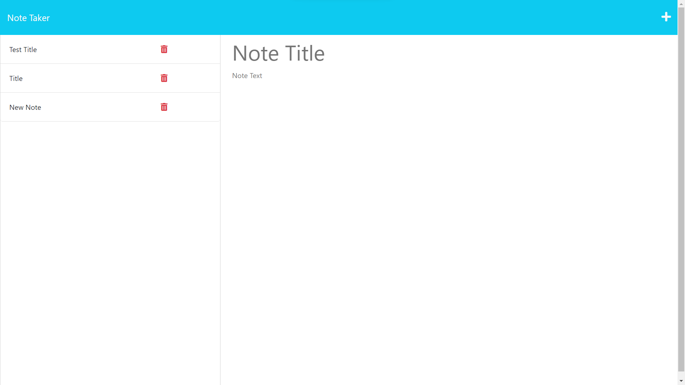

# NoteTaker
## Description
Users can write new notes and save them to a file. There is also the option to retrieve and/or delete existing notes.

## Screenshot

## License
This project is licensed under the MIT License - see the LICENSE.md file for details.

## Link to Site
https://salty-retreat-81729-571e72e7135e.herokuapp.com/